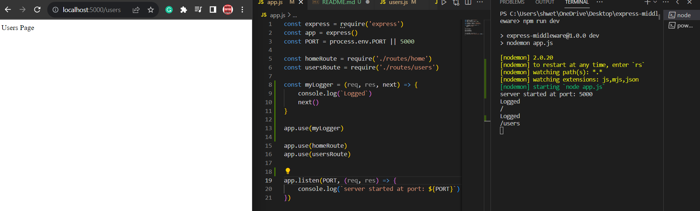
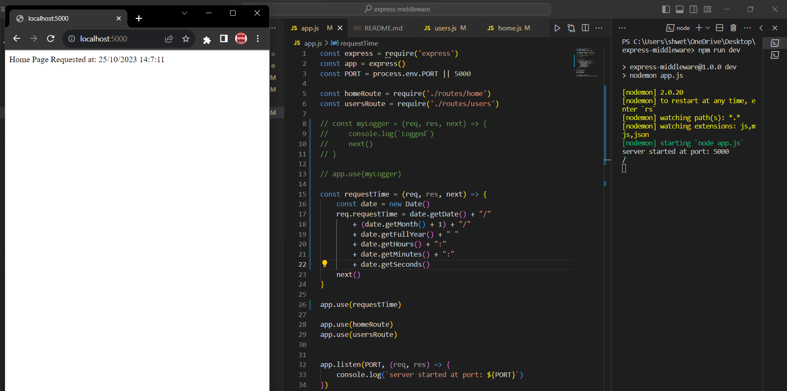
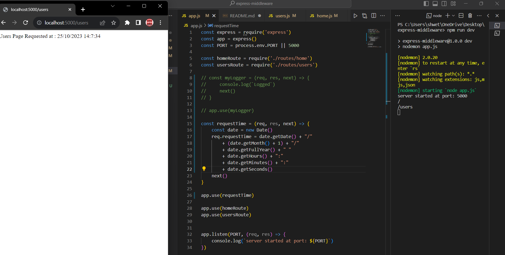
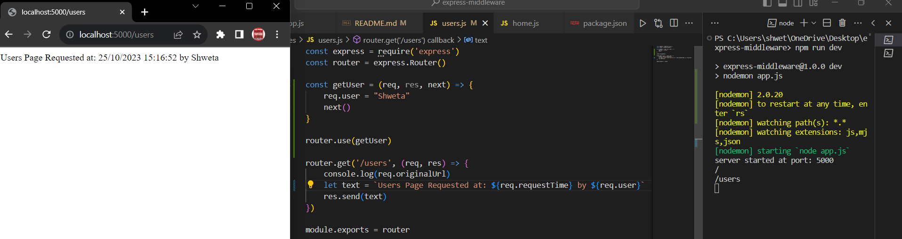

References:- 
- 
- [Writing Middleware](https://expressjs.com/en/guide/writing-middleware.html)

- [Using Middleware](https://expressjs.com/en/guide/using-middleware.html)

- [Middleware : Medium Article](https://selvaganesh93.medium.com/how-node-js-middleware-works-d8e02a936113)

<br>

<h2>Middleware</h2>

- Any function that executes between the server gets the request and the server sends the response. It runs in the order that we define it.

- It has access to the ```reqest object(req)```, ```response object(res)``` and the ```next``` function in the application's request-response cycle.

- The ```next``` function, when called, it invokes the next middleware which is after the current middleware.

- To load a middleware we write ```app.use(middlewareName)```

<br>

Middleware functions can perform the following tasks:- 

1. Execute any code
2. Make change in the request and the response object.
3. End the request-respone cycle.
4. Invoke/Call the other middleware

<br>

    NOTE: If the current middleware does not ends the request-response cycle, then, it must call the next() function to pass on the control to the next middleware. Otherwise the request will be left hanging.

<br>
<h3>Examples:-</h3>

<h3>1. Execute any Code</h3>



- Each time the app recieves a request to any route(root & users in this case), it prints ```Logged``` to the terminal, because ```myLogger``` is a global middleware in this case.

- The middleware function which is loaded first, gets executed first, i.e. they are executed in the order they are loaded.

<br>
        
    NOTE: If myLogger is loaded after the routes(root & users), then the control never reachers to the myLogger middleware and 'Logged' never gets prints to the terminal. It is because the route handlers of the root & users, terminates the request-response cycle. Hence, it is important to load myLogger before loading/writing the routes, if we want the middleware to get executed each time before we hit that route.

<br>

<h3>2. Make change in the Request Object</h3>






- We have created the ```requestTime``` middleware that makes change in the ```request object(req)``` by adding the ```requestTime``` property to it(the name of the property can be anything).

- Now, whenever we hit(make request to) any of the route(root or users), we'll be able to see the time at which the route was requested.

- It is applied on all the route.

<br>

<h3>Types of Middleware in Express</h3>

1. Application-level middleware

- It is like a global middleware which gets executed/called everytime we make a request(i.e everytime we hit a route).

- In the examples both ```myLogger``` & ```requestTime``` are application-level middleware.

2. Route-level middleware

- It is bound/specific to a route.



- The ```getUser``` middleware is bound only to the ```users``` route and won't work for the root route.